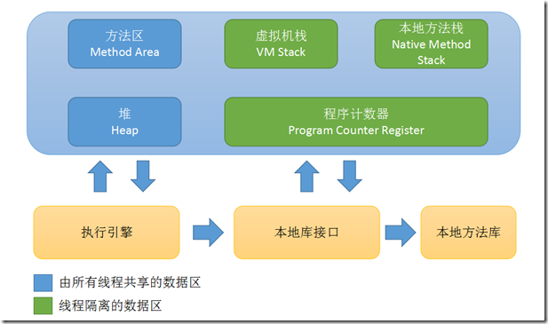

# 运行时数据区域

[TOC]

## 目录

- [程序计数器](#1-程序计数器)
- [Java虚拟机栈](#2-Java虚拟机栈)

## 1. 程序计数器
程序计数器可以看做当前线程所执行的字节码的行号指示器。字节码解释器工作时就是通过改变这个计数器的值来获取下一条需要执行的指令，分支、循环、跳转、异常处理、线程恢复等基础功能都需要依赖这个计数器完成。

为了线程切换后能恢复到正确的执行位置，每条线程都需要一个独立的程序计数器，各条线程之间计数器互不影响独立存储。

如果线程执行的是一个JAVA方法，这个计数器记录的就是正在执行的虚拟机字节码指令的地址值；如果是Native方法，这个计数器的值则为Undefined.

## 2. Java虚拟机栈
Java虚拟机栈描述的是Java方法执行的内存模型：每个方法在执行的同时都会创建一个栈帧（Stack Frame）用于存储局部变量表、操作数栈、动态链接、方法出口等信息。每个方法从调用直至执行完成的过程，就对应一个栈帧在虚拟机栈入栈到出栈的过程。

