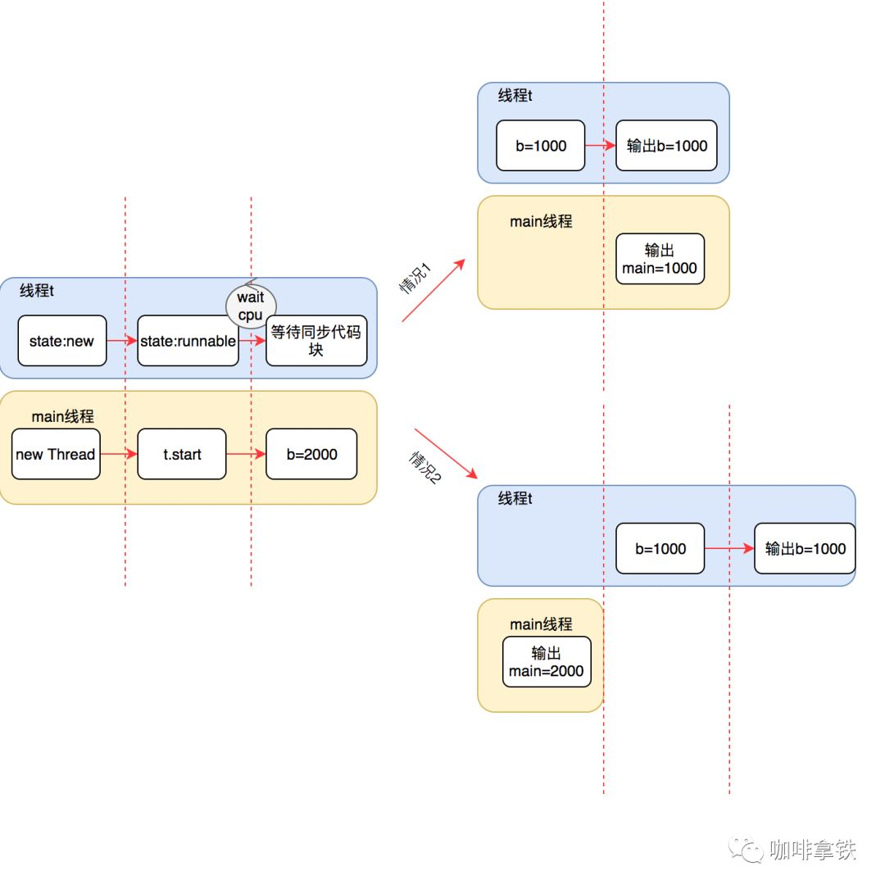

[TOC]

## 1. 流程


## 2. 安全等级
1. 不可变
2. 绝对线程安全
3. 相对线程安全
4. 线程兼容
5. 线程对立

### 2.1 不可变（Immutable）
> 线程的调度和交替执行不会对对象造成任何改变。同样不可变的还有自定义常量,final及常量池中的对象同样都是不可变的。

如：String都是常见的不可变类型，同样的枚举类用来实现的单例模式是天生自带的线程安全

### 2.2 绝对线程安全
> 定义:当多个线程访问某个类时，不管运行时环境采用何种调度方式或者这些线程将如何交替进行，并且在主调代码中不需要任何额外的同步或协同，这个类都能表现出正确的行为，那么称这个类是线程安全的。

要实现一个绝对线程安全的类通常需要付出很大的、甚至有时候是不切实际的代价。如Vector，虽然Vectorget和remove都是synchronized修饰的，但还是展现了Vector其实不是绝对线程安全。简单介绍下这个例子:

```java
    public Object getLast(Vector list) {
        return list.get(list.size() - 1);
    }

    public void deleteLast(Vector list) {
        list.remove(list.size() - 1);
    }
```
如果我们使用多个线程执行上面的代码，虽然remove和get是同步保证的，但是会出现这个问题有可能已经remove掉了最后一个元素，但是list.size()这个时候已经获取了，其实get的时候就会抛出异常，因为那个元素已经remove。

### 2.3 相对线程安全
> 定义：“调用这个对象的行为”限定为“对对象单独的操作”。保证对这个对象单独的操作是线程安全的，我们在调用的时候不需要做额外的操作，但是对于一些特定的顺序连续调用，需要额外的同步手段。
```java
    public synchronized Object getLast(Vector list) {
        return list.get(list.size() - 1);
    }

    public synchronized void deleteLast(Vector list) {
        list.remove(list.size() - 1);
    }
```

### 2.4 线程兼容
线程兼容是指其对象并不是线程安全，但是可以通过调用端正确地使用同步手段，比如我们可以对ArrayList进行加锁，一样可以达到Vector的效果。

### 2.5 线程对立
线程对立是指无论调用端是否采取了同步措施，都无法在多线程环境中并发使用的代码。通常都是有害的，应当尽量避免。

## 3 内存可见性

计算机为了解决主内存与CPU运行速度的差距，在CPU与主内存之间添加了一级或多级高速缓冲存储器（Cache）,每个Cache由多个Cache行组成，这些Cache一般是集成到CPU内部，所以也叫CPU Cache。当我们写入变量时，实际是写入当前CPU的Cache中，而不是直接写入主内存中，并且当前CPU核对自己Cache写入的变量对其它CPU核是不可见的，这就是JAVA内存模型中共享变量的内存不可见问题。

在JVM中，可以使用volatile关键字修饰变量，写入该变量的时候会把Cache直接刷新回内存，读取时会把Cache内缓存失效，然后从主内存加载数据，这会破坏Cache的命中率，对性能是有损的。

## 4 内存屏障

屏障指令:
1. 写内存屏障（Store Memory Barrier）：处理器将存储缓存值写回主存（阻塞方式）.
2. 读内存屏障（Load Memory Barrier）：处理器，处理失效队列（阻塞方式）.

屏障类型:

|      屏障类型         |        伪代码         |          说明            |
| :------------------: | :------------------: | :---------------------: |
| LoadLoad Barrier     | Load1;Barrier;Load2  | 确保 Load1 数据的读取,先于 Load2 及后续读取指令 |
| StoreStore Barrier   | Store1;Barrier;Store2 | 确保 Store1 数据对其它处理器可见 ( 刷新到内存 ) 先于 Store2 前写入完成, 并对所有处理器可见 |
| LoadStore Barrier    | Load1;Barrier;Store2  | Load1 在 Store2 之前读取完成 |
| StoreLoad Barrier | Store1;Barrier;Load2 | Store1 在 Load2 之前写入完成,并对所有处理器可见 |

- volatile : **读前插**读屏障，**写后加**写屏障，**避免CPU重排**导致的问题，实现多线程之间数据的**可见性**。
- 对于处理器来说，内存屏障会导致**cpu缓存的刷新**，刷新时，会遵循缓存一致性协议。

## 5 如何解决线程安全
1. 互斥阻塞(悲观，加锁)
    - 使用锁会严重影响并发度，因为当线程获取锁失败后会把线程从用户态切换到内核态把线程挂起，稍后唤醒又需要从内核态切换到用户态继续运行。
    - 锁的存在还会带来死锁问题。
2. 非阻塞同步(类似乐观锁，CAS)
3. 实现不需要同步的逻辑。

> 同步是指在多个线程并发访问共享数据时，保证共享数据在同一个时刻只被一条线程（或是一些，使用信号量的时候）线程使用。

### 5.1 互斥同步
通过某种手段进行将这个数据在这个时间段给占为独有，不能让其他人有接触的机会。临界区（CriticalSection）、互斥量（Mutex）和信号量（Semaphore）都是主要的互斥实现方式。

Java中一般用ReentrantLock和synchronized实现同步。 

实际业务当中，推荐使用synchronized,在jdk1.6之后对其进行了优化会从偏向锁，轻量级锁，自旋适应锁，最后才到重量级锁。如果你在业务中需要等待可中断，等待超时，公平锁等功能的话，可以选择ReentrantLock。

### 5.2 非阻塞同步
非阻塞同步是一种乐观的手段，在乐观的手段中他会先去尝试操作，如果没有线程竞争，就成功，否则就进行补偿(一般就是死循环重试或者循环多次之后跳出)，在互斥同步最重要的问题就是进行线程阻塞和唤醒所带来的性能问题，而乐观同步策略解决了这一问题。

操作和检测是否有线程竞争这两个操作一定要保证原子性。例如我们java中的cas操作其实就是操作的硬件底层的指令。

### 5.2 无同步
线程安全场景，一般分为两类:
- 可重入代码:可重入代码也叫纯代码，可以随时中断，恢复控制权之后程序依然不会出任何错误,可重入代码的结果一般来说是可预测的:
```java
    public int sum(){
        return 1+2;
    }
```

- 线程本地存储:通过保证类是无状态的，所有的变量都存在于我们的方法之中，或者通过ThreadLocal来进行保存。