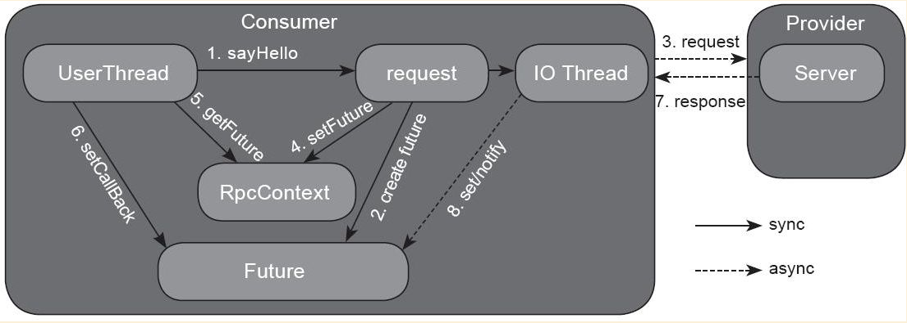

[TOC]

## 1 组件

- Provider：为服务提供者集群，服务提供者负责暴露提供的服务，在启动时会将自己提供的服务注册到服务注册中心。
- Consumer：为服务消费者集群，服务消费者通过RPC远程调用服务提供者提供的服务，在启动时会去服务注册中心订阅自己所需服务的地址列表，由服务注册中心向它异步返回其所需服务接口的提供者的地址列表，再由服务消费者根据路由规则和设置的负载均衡算法选择一个服务提供者IP进行调用。
- Registry：负责服务注册与发现；
- Monitor：为统计服务的调用次数和调用时间的监控中心。服务消费者和提供者，在内存中累计调用次数和调用耗时，并定时每分钟发送一次统计数据到监控中心，监控中心则使用数据绘制图表来显示。监控平台不是分布式系统必须有的，但是这些数据有助于系统运维和调优。服务提供者和消费者可以直接配置监控平台的地址，也可以通过服务注册中心来获取。

## 2 异步调用

1. 服务消费端使用用户线程发起RPC调用。
2. 如果是用户线程，会转换成IO线程，使用NIO发起远程调用。
3. 用户线程通过步骤3创建了一个Future对象。
4. 通过步骤4将其设置到RpcContext中。
5. 用户线程则可以在某个时间从RpcContext中获取设置的Future对象。
6. 设置回调函数，用户线程返回。
7. 提供方返回结果。
8. 调用方线程模型中的线程池线程会把结果写入Future，然后就会回调注册的回调函数。