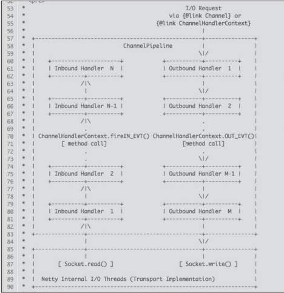
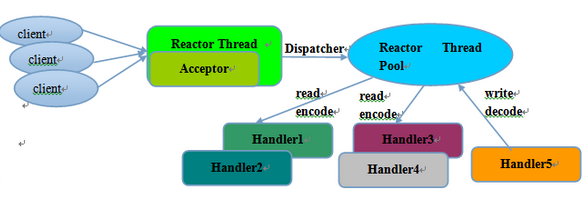

[TOC]

## 1 概念

### 1.2 通道（Channel）

- Channel：是通道的意思，表示一个连接，可以理解为每一个请求，就是一个Channel。这是在JDK NIO类库里面提供的一个概念，JDK里面的通道是java.nio.channels.Channel，JDK中的实现类有客户端套接字通道java.nio.channels.SocketChannel和服务端监听套接字通道java.nio.channels.ServerSocketChannel。Channel的出现是为了支持异步IO操作。io.netty.channel.Channel是Netty框架自己定义的一个通道接口。Netty实现的客户端NIO套接字通道是io.netty.channel.socket.nio.NioSocketChannel，提供的服务器端NIO套接字通道是io.netty.channel.socket.nio.NioServerSocketChannel。
  - NioSocketChannel：代表异步的客户端 TCP Socket 连接。内部管理了一个Java NIO中的java.nio.channels.SocketChannel实例，其被用来创建java.nio.channels.SocketChannel的实例和设置该实例的属性，并调用其connect方法向服务端发起TCP链接。
  - NioServerSocketChannel：代表异步的服务器端 TCP Socket 通道。内部管理了一个Java NIO中的java.nio.channels.ServerSocketChannel实例，用来创建ServerSocketChannel实例和设置该实例属性，并调用该实例的bind方法在指定端口监听客户端的链接。
  - NioDatagramChannel, 异步的 UDP 连接
  - NioSctpChannel, 异步的客户端 Sctp 连接.
  - NioSctpServerChannel, 异步的 Sctp 服务器端连接.
  - OioSocketChannel, 同步的客户端 TCP Socket 连接.
  - OioServerSocketChannel, 同步的服务器端 TCP Socket 连接.
  - OioDatagramChannel, 同步的 UDP 连接
  - OioSctpChannel, 同步的 Sctp 服务器端连接.
  - OioSctpServerChannel, 同步的客户端 TCP Socket 连接.

### 1.3 处理管道（ChannelPipeline）

- ChannelPipeline：用于保存处理过程需要用到的ChannelHandler和ChannelHandlerContext。类似于Tomcat容器中的Filter链，属于设计模式中的责任链模式，其中链上的每个节点就是一个ChannelHandler。在Netty中，每个Channel有属于自己的ChannelPipeline，管线中的处理器会对从Channel中读取或者要写入Channel中的数据进行依次处理。
  - ChannelHandler：核心处理业务就在这里，用于处理业务请求
  - ChannelHandlerContext：用于传输业务数据

### 1.2 事件循环器(EventLoopGroup)

Netty 之所以能提供高性能网络通信，其中一个原因是它使用Reactor线程模型。Netty 提供了许多不同的 EventLoopGroup(I/O操作的多线程事件循环器) 的实现用来处理不同的传输,每个EventLoopGroup本身都是一个线程池，其中包含了自定义个数的NioEventLoop，每个NioEventLoop是一个线程池，并且每个NioEventLoop里面持有自己的多路复用选择器Selector，可以高效的处理N个Channel。在Netty中，客户端持有一个EventLoopGroup用来处理网络IO操作；在服务器端持有两个EventLoopGroup，其中boss组是专门用来接收客户端发来的TCP链接请求的，worker组是专门用来处理完成三次握手的链接套接字的网络IO请求的。

Reactor线程模型：



> Channel与EventLoop的关系：在Netty中，NioEventLoop是EventLoop的一个实现，每个NioEventLoop中会管理自己的一个selector选择器和监控选择器就绪事件的线程；每个Channel在整个生命周期中固定关联到某一个NioEventLoop；但是，每个NioEventLoop中可以关联多个Channel。

### 1.3 ByteBuf

ByteBuf是一个存储字节的容器，有读索引和写索引对整段字节缓存进行读写，支持get/set，支持对其中每一个字节进行读写

使用模式：
1. Heap Buffer 堆缓冲区: 将数据存储在堆空间。
2. Direct Buffer 直接缓冲区: 内存分配不发生在堆，jdk1.4引入的nio的ByteBuffer类允许jvm通过本地方法调用分配内存，这样做有两个好处:
   1. 免去中间交换的内存拷贝, 提升IO处理速度; 直接缓冲区的内容可以驻留在垃圾回收扫描的堆区以外
   2. DirectBuffer 在 -XX:MaxDirectMemorySize=xxM大小限制下, 使用 Heap 之外的内存, GC对此”无能为力”,也就意味着规避了在高负载下频繁的GC过程对应用线程的中断影响.
3. Composite Buffer 复合缓冲区: 相当于多个不同ByteBuf的视图，是netty提供的。

### 1.4 Bootstrap
Bootstrap 是 Netty 提供的一个工厂类, 负责为客户端和服务端应用程序创建通道, 完成 Netty 的客户端或服务器端的 Netty 初始化.


### 1.5 NioSocketChannel 初始化过程
Netty 中, Channel 是一个 Socket 的抽象, 提供了关于 Socket 状态(是否是连接还是断开) 以及对 Socket 的读写等操作. 每当 Netty 建立了一个连接后, 都会有一个对应的 Channel 实例.

## 2 线程模型


每个NioSocketChannel对应的读写事件都是在与其对应的NioEventLoop管理的单线程内执行的，不存在并发，所以无须加锁处理。

另外当从NioSocketChannel中读取数据时，并不是使用业务线程来阻塞等待，而是等NioEventLoop中的IO轮询线程发现Selector上有数据就绪时，通过事件通知方式来通知我们业务数据已经就绪，可以来读取并处理了。

发起请求后请求会马上返回，而不会阻塞我们的业务调用线程；如果我们想要获取请求的响应结果，也不需要业务调用线程使用阻塞的方式来等待，而是当响应结果出来时使用IO线程异步通知业务，由此可知，在整个请求–响应过程中，业务线程不会由于阻塞等待而不能干其他事情。

### 2.1 服务端

当NettyServer启动时会创建两个 NioEventLoopGroup 线程池组，其中 boss 组用来接收客户端发来的连接，worker组则负责对完成 TCP 三次握手的连接进行处理；图中每个 NioEventLoopGroup 里面包含了多个 NioEventLoop，每个 NioEventLoop 中包含了一个 NIOSelector、一个队列、一个线程；其中线程用来做轮询注册到 Selector 上的 Channel 的读写事件和对投递到队列里面的事件进行处理。

当NettyServer启动时会注册监听套接字通道NioServerSocketChannel到boss线程池组中的某一个NioEventLoop管理的Selector上，与其对应的线程会负责轮询该监听套接字上的连接请求；当客户端发来一个连接请求时，boss线程池组中注册了监听套接字的NioEventLoop中的Selector会读取TCP三次握手的请求，然后创建对应的连接套接字通道NioSocketChannel，接着把其注册到worker线程池组的某一个NioEventLoop中管理的一个NIOSelector上，该连接套接字通道NioSocketChannel上的所有读写事件都由该NioEventLoop管理。当客户端发来多个连接时，NettyServer端会创建多个NioSocketChannel，而worker线程池组中的NioEventLoop是有个数限制的，所以Netty有一定的策略把很多NioSocketChannel注册到不同的NioEventLoop上，也就是每个NioEventLoop中会管理好多客户端发来的连接，并通过循环轮询处理每个连接的读写事件。

### 2.2 客户端

当NettyClient启动时会创建一个NioEventLoopGroup，用来发起请求并对建立TCP三次连接的套接字的读写事件进行处理。当调用Bootstrap的connect方法发起连接请求后内部会创建一个NioSocketChannel用来代表该请求，并且会把该NioSocketChannel注册到NioSocketChannel管理的某个NioEventLoop的Selector上，该NioEventLoop的读写事件都由该NioEventLoop负责处理。

Netty之所以说是异步非阻塞网络框架，是因为通过NioSocketChannel的write系列方法向连接里面写入数据时是非阻塞的，是可以马上返回的（即使调用写入的线程是我们的业务线程）。这是Netty通过在ChannelPipeline中判断调用NioSocketChannel的write的调用线程是不是其对应的NioEventLoop中的线程来实现的。


## 3 高HA

### 3.1 netty 缓冲区的上限保护机制
1. 在内存分配的时候指定缓冲区长度上限.
2. 在对缓冲区进行写入操作的时候，如果缓冲区容量不足需要扩展，首先对最大容量进行判断，如果扩展后的容量超过上限，则拒绝扩展;
3. 在解码的时候，对消息长度进行判断，如果超过最大容量上限，则抛出解码异常，拒绝分配内存。

### 3.2 Netty 流量整形
一个典型应用是基于下游网络结点的TP指标来控制本地流量的输出。流量整形与流量监管的主要区别在于，流量整形对流量监管中需要丢弃的报文进行缓存——通常是将它们放入缓冲区或队列内，也称流量整形（Traffic Shaping，简称TS）。当令牌桶有足够的令牌时，再均匀的向外发送这些被缓存的报文。流量整形与流量监管的另一区别是，整形可能会增加延迟，而监管几乎不引入额外的延迟。


1. 全局流量整形的作用范围是进程级的，无论你创建了多少个Channel，它的作用域针对所有的Channel。
2. 单链路流量整形与全局流量整形的最大区别就是它以单个链路为作用域，可以对不同的链路设置不同的整形策略，整形参数与全局流量整形相同。

## 4 优化
1. 使用 Netty 4的内存池，减少高峰期 ByteBuf 频繁创建和销毁导致的GC频率和时间；
2. 在程序中充分利用 Netty 提供的“零拷贝”特性，减少额外的内存拷贝，例如使用CompositeByteBuf而不是分别为Head和Body各创建一个ByteBuf对象；
3. TCP参数的优化，设置合理的Send和Receive Buffer，通常建议值为64K - 128K；
4. 软中断：如果Linux内核版本支持RPS（2.6.35以上版本），开启RPS后可以实现软中断，提升网络吞吐量；
5. 无锁化串行开发理念：遵循Netty 4的线程模型优化理念，防止增加线程竞争。
6. 消息发送队列的上限保护、链路中断时缓存中待发送消息回调通知业务、增加错误码、异常日志打印抑制、I/O线程健康度检测等

## 5 注意

1. Netty 里所有的操作都是异步的
```java
    // 下面的代码中在消息被发送之前可能会先关闭连接。
    Channel ch = ...;
    ch.writeAndFlush(message);
    ch.close();
```

2. 一旦引入内存池机制，对象的生命周期将由内存池负责管理，这通常是个全局引用，如果不显式释放JVM是不会回收这部分内存的.

## 6 问题

1. 完成TCP三次握手的套接字应该注册到worker线程池中的哪一个NioEventLoop的Selector上？

   关于NioEventLoop的分配，Netty默认使用的是PowerOfTwoEventExecutorChooser，其代码如下：

   ```java
       private final class PowerOfTwoEventExecutorChooser implements EventExecutorChooser {
           @Override
           public EventExecutor next() {
               return children[childIndex.getAndIncrement() & children.length - 1];
           }
       }
   ```

   可知是采用轮询取模的方式来进行分配。

2. 如果NioEventLoop中的线程负责监听注册到Selector上的所有连接的读写事件和处理队列里面的消息，那么会不会导致由于处理队列里面任务耗时太长导致来不及处理连接的读写事件?

   Netty默认是采用时间均分策略来避免某一方处于饥饿状态，可以参见NioEventLoop的run方法内的代码片段：

   ```java
   // 1 开始记录处理时间
   final long ioStartTime = System.nanoTime();
   try {
       //1.1 处理所有注册到当前 NioEventLoop 的 Selector 上的所有
       // 连接套接字的读写事件
       processSelectedKeys();
   } finally {
       // 1.2 计算连接套接字处理耗时，ioRatio 默认为 50，统计其耗时
       final long ioTime = System.nanoTime() - ioStartTime;
       // 1.3 运行队列里面任务
       // 由于默认情况下ioRatio为50，所以代码1.3尝试使用与
       // 代码1.2执行相同的时间来运行队列里面的任务，也就是处
       // 理套接字读写事件与运行队列里面任务是使用时间片轮转方式轮询执行。
       runAllTasks(ioTime * (100 - ioRatio) / ioRatio);
   }
   ```

   

3. 多个套接字注册到同一个NioEventLoop的Selector上，使用单线程轮询处理每个套接字上的事件，如果某一个套接字网络请求比较频繁，轮询线程是不是会一直处理该套接字的请求，而使其他套接字请求得不到及时处理。

   NioEventLoop的processSelectedKeysOptimized方法，该方法内会轮询注册到自己的Selector上的所有连接套接字的读写事件：

   ```java
   
   ```

   


