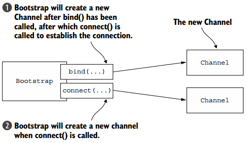
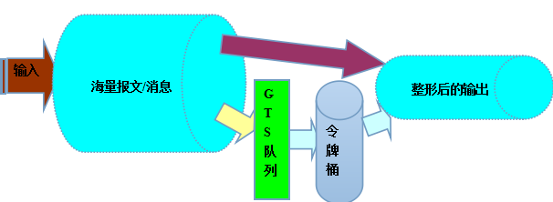

## 连接协议
不同协议不同的阻塞类型的连接都有不同的 Channel 类型与之对应下面是一些常用的 Channel 类型：

- NioSocketChannel, 代表异步的客户端 TCP Socket 连接.
- NioServerSocketChannel, 异步的服务器端 TCP Socket 连接.
- NioDatagramChannel, 异步的 UDP 连接
- NioSctpChannel, 异步的客户端 Sctp 连接.
- NioSctpServerChannel, 异步的 Sctp 服务器端连接.
- OioSocketChannel, 同步的客户端 TCP Socket 连接.
- OioServerSocketChannel, 同步的服务器端 TCP Socket 连接.
- OioDatagramChannel, 同步的 UDP 连接
- OioSctpChannel, 同步的 Sctp 服务器端连接.
- OioSctpServerChannel, 同步的客户端 TCP Socket 连接.

## 概念

### Channel
- Channel，表示一个连接，可以理解为每一个请求，就是一个Channel
- ChannelHandler，核心处理业务就在这里，用于处理业务请求
- ChannelHandlerContext，用于传输业务数据
- ChannelPipeline，用于保存处理过程需要用到的ChannelHandler和ChannelHandlerContext

### ByteBuf

ByteBuf是一个存储字节的容器，有读索引和写索引对整段字节缓存进行读写，支持get/set，支持对其中每一个字节进行读写

使用模式：
1. Heap Buffer 堆缓冲区: 将数据存储在堆空间。
2. Direct Buffer 直接缓冲区: 内存分配不发生在堆，jdk1.4引入的nio的ByteBuffer类允许jvm通过本地方法调用分配内存，这样做有两个好处:
   1. 免去中间交换的内存拷贝, 提升IO处理速度; 直接缓冲区的内容可以驻留在垃圾回收扫描的堆区以外
   2. DirectBuffer 在 -XX:MaxDirectMemorySize=xxM大小限制下, 使用 Heap 之外的内存, GC对此”无能为力”,也就意味着规避了在高负载下频繁的GC过程对应用线程的中断影响.
3. Composite Buffer 复合缓冲区: 相当于多个不同ByteBuf的视图，是netty提供的。

### Bootstrap
Bootstrap 是 Netty 提供的一个工厂类, 负责为客户端和服务端应用程序创建通道, 完成 Netty 的客户端或服务器端的 Netty 初始化.


### EventLoopGroup
Netty 提供了许多不同的 EventLoopGroup(I/O操作的多线程事件循环器) 的实现用来处理不同的传输, 通过控制NioEventLoopGroup的NioEventLoop个数来收敛线程，防止线程膨胀。NioEventLoop聚合了一个多路复用器Selector，可以高效的处理N个Channel，它的线程模型如下：


### NioSocketChannel 初始化过程
Netty 中, Channel 是一个 Socket 的抽象, 提供了关于 Socket 状态(是否是连接还是断开) 以及对 Socket 的读写等操作. 每当 Netty 建立了一个连接后, 都会有一个对应的 Channel 实例.

## 高HA

### netty 缓冲区的上限保护机制
1. 在内存分配的时候指定缓冲区长度上限.
2. 在对缓冲区进行写入操作的时候，如果缓冲区容量不足需要扩展，首先对最大容量进行判断，如果扩展后的容量超过上限，则拒绝扩展;
3. 在解码的时候，对消息长度进行判断，如果超过最大容量上限，则抛出解码异常，拒绝分配内存。

### Netty 流量整形
一个典型应用是基于下游网络结点的TP指标来控制本地流量的输出。流量整形与流量监管的主要区别在于，流量整形对流量监管中需要丢弃的报文进行缓存——通常是将它们放入缓冲区或队列内，也称流量整形（Traffic Shaping，简称TS）。当令牌桶有足够的令牌时，再均匀的向外发送这些被缓存的报文。流量整形与流量监管的另一区别是，整形可能会增加延迟，而监管几乎不引入额外的延迟。


1. 全局流量整形的作用范围是进程级的，无论你创建了多少个Channel，它的作用域针对所有的Channel。
2. 单链路流量整形与全局流量整形的最大区别就是它以单个链路为作用域，可以对不同的链路设置不同的整形策略，整形参数与全局流量整形相同。

## 优化
1. 使用 Netty 4的内存池，减少高峰期 ByteBuf 频繁创建和销毁导致的GC频率和时间；
2. 在程序中充分利用 Netty 提供的“零拷贝”特性，减少额外的内存拷贝，例如使用CompositeByteBuf而不是分别为Head和Body各创建一个ByteBuf对象；
3. TCP参数的优化，设置合理的Send和Receive Buffer，通常建议值为64K - 128K；
4. 软中断：如果Linux内核版本支持RPS（2.6.35以上版本），开启RPS后可以实现软中断，提升网络吞吐量；
5. 无锁化串行开发理念：遵循Netty 4的线程模型优化理念，防止增加线程竞争。
6. 消息发送队列的上限保护、链路中断时缓存中待发送消息回调通知业务、增加错误码、异常日志打印抑制、I/O线程健康度检测等

## 注意
1. Netty 里所有的操作都是异步的
```java
    // 下面的代码中在消息被发送之前可能会先关闭连接。
    Channel ch = ...;
    ch.writeAndFlush(message);
    ch.close();
```

2. 一旦引入内存池机制，对象的生命周期将由内存池负责管理，这通常是个全局引用，如果不显式释放JVM是不会回收这部分内存的.

3. 