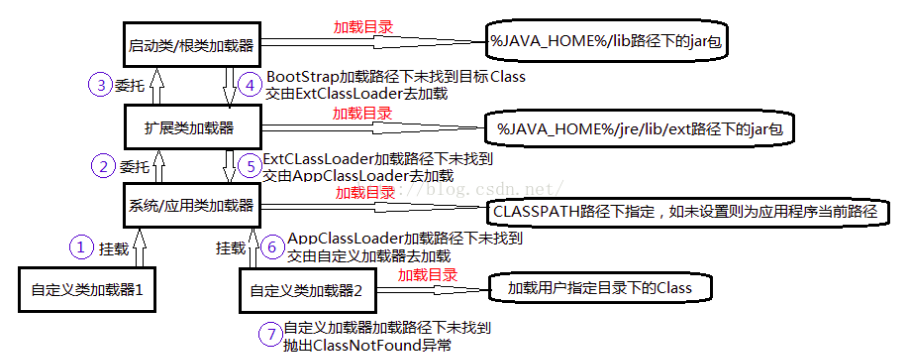

# 反射

[TOC]

## 目录
- [类加载器](#1类加载器)
  - [类加载流程](#11类加载流程)
  - [类的链接流程](#12类的链接流程)
  - [类的初始化](#13类的初始化)
    - [主动引用初始化](#131主动引用初始化)
    - [被动引用初始化](#132被动引用初始化)
  - [类的唯一性识别](#14类的唯一性识别)
  - [JVM类加载器分类](#15JVM类加载器分类)
  - [加载机制](#16加载机制)
  - [API](#17API)

## 1.类加载器

### 1.1类加载流程
1. 通过一个类的全限定名来获取定义此类的二进制字节流。
2. 将定义类的二进制字节流所代表的静态存储结构转换为方法区的运行时数据结构。
3. 在堆中生成一个代表该类的java.lang.Class对象，作为方法区数据的访问入口。

### 1.2类的链接流程
1. 验证：验证被加载后的类是否有正确的结构，类数据是否会符合虚拟机的要求，确保不会危害虚拟机安全。
2. 准备：为类的静态变量（static filed）在方法区分配内存，并赋默认初值（0值或null值）。
3. 解析：将类的二进制数据中的符号引用换为直接引用。

### 1.3类的初始化
主要工作是为静态变量赋程序设定的初值。

#### 1.3.1主动引用初始化
1. 使用new字节码指令创建类的实例，或者使用getstatic、putstatic读取或设置一个静态字段的值（放入常量池中的常量除外），或者调用一个静态方法的时候，对应类必须进行过初始化。
2. 使用java.lang.reflect.*的方法对类进行反射调用的时候，如果类还没有进行过初始化，则需要先触发其初始化.
3. 初始化一个类的时候，如果他的父亲还没有被初始化，则先去初始化其父类。
4. 当jvm启动时，用户指定一个要执行的主类（包含static void main(String[] args)），则jvm会先去初始化这个类。
5. 使用jdk1.7的动态语言支持时，如果一个java.lang.invoke.MethodHandle实例最后的解析结果REF_getStatic、REF_putStatic、RE_invokeStatic的方法句柄，并且这个方法句柄对应的类没有进行初始化，则需要先触发其初始化。

#### 1.3.2被动引用初始化
（除五种主动引用以外）类引用方式不会触发类初始化

### 1.4类的唯一性识别
- 两个类来自同一个Class文件
- 两个类是由同一个虚拟机加载
- 两个类是由同一个类加载器加载

方法：
1. 判断两个实例对象的引用是否指向内存中同一个实例对象，使用 Class对象的equals()方法，obj1.equals(obj2)；
2. 判断实例对象是否为某个类、接口或其子类、子接口的实例对象，使用Class对象的isInstance()方法，class.isInstance(obj)；
3. 判断实例对象是否为某个类、接口的实例，使用instanceof关键字，obj instanceof class；
4. 判断一个类是否为另一个类本身或其子类、子接口，可以使用Class对象的isAssignableFrom()方法，class1.isAssignableFrom(class2)。

### 1.5JVM类加载器分类
- BootStrap ClassLoader:启动类加载器，也叫根类加载器，它负责加载Java的核心类库，加载如(%JAVA_HOME%/lib)目录下的rt.jar（包含System、String这样的核心类）这样的核心类库。根类加载器非常特殊，它不是java.lang.ClassLoader的子类，它是JVM自身内部由C/C++实现的，并不是Java实现的。
- Extension ClassLoader:扩展类加载器，它负责加载扩展目录(%JAVA_HOME%/jre/lib/ext)下的jar包，用户可以把自己开发的类打包成jar包放在这个目录下即可扩展核心类以外的新功能。
- System ClassLoader\APP ClassLoader:系统类加载器或称为应用程序类加载器，是加载CLASSPATH环境变量所指定的jar包与类路径。一般来说，用户自定义的类就是由APP ClassLoader加载的。
- 自定义类加载器
  - 如果不想打破双亲委派模型，重写findClass方法即可
  - 如果想打破双亲委派模型，重写loadClass方法
  
### 1.6加载机制

双亲委派加载机制:当一个类收到了类加载请求，他首先不会尝试自己去加载这个类，而是把这个请求委派给父类去完成，每一个层次类加载器都是如此，因此所有的加载请求都应该传送到启动类加载其中，只有当父类加载器反馈自己无法完成这个请求的时候（在它的加载路径下没有找到所需加载的Class），子类加载器才会尝试自己去加载。

### 1.7API
- Class<?> defineClass(String, byte[], int, int) :将一个 byte 数组转换为 Class 类的实例。这个方法被声明为final的。
- Class<?> findClass(String) :使用指定的二进制名称查找类。
- Class<?> loadClass(String) :使用指定的二进制名称来加载类。
- void resolveClass(Class<?>) :链接指定的类。
