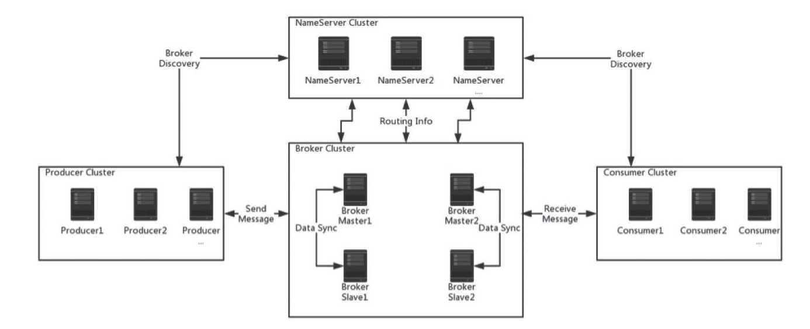

[TOC]

## 1 架构图

- NameServer集群：名称服务集群提供轻量级的服务发现与路由服务，每个名称服务器记录了全部的Broker的路由信息，并且提供相应的读写服务，支持快速存储扩展。
- Broker集群：Broker通过提供轻量级的主题和队列机制来维护消息的存储。支持推和拉两种模型（推模型其通过消费者马上不停的循环的拉实现），并提供了强大的平滑峰值保证其在原始事件顺序的被消费的能力。
- Producer集群：分布式的生产者集群发送消息到Broker集群，具体选择哪一个Broker机器是通过一定的负载均衡策略来决定的，发送消息中支持故障快速恢复。
- Consumer集群：消费者集群，在推和拉模型中支持分布式部署。支持集群消费、消息广播、消息订阅机制。

Broker在启动时会连接NameServer，然后将topic信息注册到NameServer，NameServer维护了所有topic信息对应的Broker路由信息。Broker与NameServer之间是有心跳检查的，NameServer发现Broker挂了后，会从注册信息里面删除该Broker，这类似zookeeper实现的服务注册；

Producer需要配置NameServer的地址，然后定时从NameServer获取对应的topic的路由信息（这个topic的消息应该路由到哪个Broker）。同时Producer与NameServer、Producer与Broker有心跳检查。

Consumer同样需要配置NameServer的地址，然后定时从NameServer获取对应的topic的路由信息（从哪个Broker的消息队列获取消息）。同时Consumer与NameServer、Consumer与Broker有心跳检查。